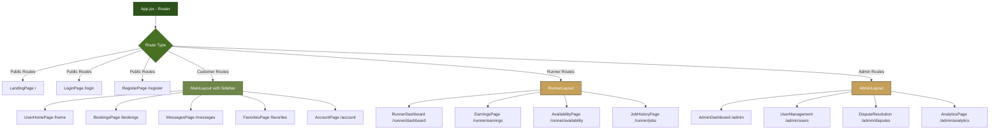

# ConnectUs - Smart Services Booking Platform
live link : https://connect-us-bice-five.vercel.app/
A dual-platform (Web + Mobile) marketplace connecting customers with trusted local runners who can shop for them. Users can book runners, upload product photos, make secure payments, track bookings, and leave reviews.

---

## ✨ **Features**

**Customers**
- Photo-based product requests | Runner discovery by category | Calendar booking | Secure payments | Reviews & ratings

**Runners**
- Earnings dashboard | Availability management | Job notifications | Rating system | Delivery options (walk/courier)

**Admins**
- User management | Platform analytics | Dispute resolution | Safety monitoring

---

## 🛠️ **Tech Stack**

### Development Technologies
<div align="center">
  
</div>

### Frontend
<div align="center">
  
  
  
  
  
</div>

### Mobile
<div align="center">
  
  
</div>

### Backend (Planned)
<div align="center">
  
  
  
</div>

---

## 🏗 **System Architecture**

### Application Flow Diagram
The application uses React Router v6 within `App.jsx` to handle seamless transitions between public pages, customer app, runner dashboard, and admin panel.



---

# ⚙️ Installation Guide

## ✅ Prerequisites

Ensure you have the following installed:

- Node.js (v18 or later recommended)
- npm or yarn
- Git
- PostgreSQL (for backend integration when implemented)

Check installed versions:

```bash
node -v
npm -v
git --version
```

---

## 📥 Clone the Repository

```bash
git clone https://github.com/your-username/ConnectUs.git
cd ConnectUs
```

---

## 📦 Install Dependencies

### Web Application

```bash
cd frontend
npm install
```

### Mobile Application

```bash
cd mobile
npm install
```

---

## ▶️ Run the Web App

```bash
npm run dev
```

The development server will run at:

```
http://localhost:5173
```

---

## 📱 Run the Mobile App (Expo)

```bash
npx expo start
```

Then scan the QR code using:
- Expo Go (Android)
- Camera App (iOS)

---

Install all dependencies using:

```bash
npm install
```

---

# 📁 Project Structure

```
ConnectUs/
│
├── frontend/
│   ├── src/
│   │   ├── components/
│   │   ├── pages/
│   │   ├── layouts/
│   │   ├── assets/
│   │   └── App.jsx
│   │
│   └── package.json
│
├── mobile/
│   ├── screens/
│   ├── components/
│   └── App.js
│
├── backend/ (planned)
│   ├── routes/
│   ├── controllers/
│   ├── models/
│   └── server.js
│
└── README.md
```
